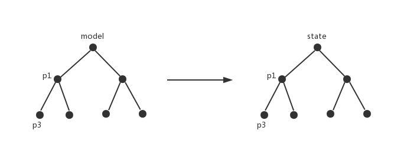

# femo docs

### Background
I have been always using redux on my work since 3 years ago.I have learned a lot from redux.Until today,
redux also has influences on me and inspires me to create *femo*.

*femo* simplifies redux and focus on the data, exclude the process. *femo* is totally function-centric.
There is a strong abstract for data, called *model*.All operations are around *model*.

### Model

Model is just plain object. It consists of different nodes those present structure and maintain data.
Model is a blueprint what data structure you want.



We can choose which nodes to be *maintainable node*. 
*Maintainable node* means it can be mutated.We declare *maintainable node* like below:

```js
const person = gluer((data, state) => {
  return { 
    ...state,
    ...data
   }
}, { name: 'person', age: 10 });
```

Above illustrates:

1. *person* has an initial value *{ name: 'person', age: 10 }* which indicates
*person*'s structure and type.
2. *person* has a pure function to produce a new state by the input data and the current state

Now we can use *person* to define models:

```js
const model = {
  	tom: person,
  	jack: person,
  	rose: person,
  };
```

Defined a model simply. *person* here, is more like a template(a bit like the concept of *Class*).It can
be reused.

Finally, we let *model* work:

```js
const store = femo(model);

// subscribe
const unsubscribe = store.subscribe([store.model.tom], (tom) => {
  // if tom changes, this callback will be called
});

console.log(store.getState());
// { tome: { name: 'person', age: 10 }, jack: { name: 'person', age: 10 }, rose: { name: 'person', age: 10 } }

console.log(store.referToState(store.model));
// same as above.

console.log(store.getState() === store.referToState(store.model));
// true

console.log(store.referToState(store.model.tom));
// { name: 'person', age: 10 }

// unsubscribe
unsubscribe();
```

The complete code:

```js
import femo, { gluer } from 'femo';

const person = gluer((data, state) => {
  return { 
    ...state,
    ...data
   }
}, { name: 'person', age: 10 });

const model = {
  	tom: person,
  	jack: person,
  	rose: person,
  };

const store = femo(model);

// subscribe
const unsubscribe = store.subscribe([store.model.tom], (tom) => {
  // if tom changes, this callback will be called
});

console.log(store.getState());
// { tome: { name: 'person', age: 10 }, jack: { name: 'person', age: 10 }, rose: { name: 'person', age: 10 } }

console.log(store.referToState(store.model));
// same as above.

console.log(store.getState() === store.referToState(store.model));
// true

console.log(store.referToState(store.model.tom));
// { name: 'person', age: 10 }

// unsubscribe
unsubscribe();
```

### API

#### gluer
*declare maintainable node*

**Basic**

| param | initial value | illustration
| :---: | :---: | :---:
| fn | (data, state) => data | pure function for mutation
| initialState | - | the init value of *maintainable node* indicates the data type and structure

**Suggestion**

There is a strong suggestion *initialState* should not be empty.Further more, the *fn*'s return should keep
the same pattern with the *initialState*.We need keep *maintainable node*'s appearance and fact same.

Fox example:
```js
const friend = gluer((data, state) => {
  const result = { ...state, ...data };
  // result should be like this: { hobby: string, company: string, name: string }
  return result;
}, {
     hobby: 'beer',
     company: 'facebook',
     name: 'John'
   });
```
In typescript, the rule above is confirmed.

**Advanced**

*maintainable node* may contain complicated calculation or deep nested data structure.At this moment, we intend
 to split them into parts. *gluer* serves the ability that takes complicated calculation or deep nested data structure into
  different small parts.
  
Fox example:

```js

const goods = gluer((data, state) => {
  return {
    ...state,
    ...data,
    origin: {
      ...state.origin,
      ...data.origin,
      company: {
        ...state.origin.company,
        ...data.origin.company
      }
    }
  }
}, { 
  price: 100, 
  origin: {
    city: 'Mumbai',
    country: 'India',
    company: {
      legalPerson: 'Vishal',
      address: 'Ganges'
    }
  },
  count: 1000
})

```
Nested data structure makes assignment indirect.

We can split it into flat parts!

```js
const price = gluer(100);
const count = gluer(1000);
const company = gluer((data, state) => {
  return {
    ...state,
    ...data
  }
}, { 
  legalPerson: 'Vishal',
  address: 'Ganges'
 });

const origin = gluer((data, state) => {
  // state is latest
  // like { city: string, country: string, company: { legalPerson: string, address: string } }
  
  // here just maintains two fields: city, country, the company field is handled by company node.
  // so origin node here should not handle the origin field, although the state is complete.
  return {
    ...state,
    city: data.city,
    country: data.country
  }
}, {
  city: 'Mumbai',
  country: 'India',
  company
});
const goods = gluer((data, state) => {
  // state is latest
  return state;
}, {
  price,
  origin,
  count
});
```

We let *goods* work.
```js
const model = {
  goods
};
const store = femo(model);

console.log(store.referToState(store.model.goods));

```
How can we index *price* or *company*?
Just does above!
```js
console.log(store.referToState(store.model.goods.price)); // 100
console.log(store.referToState(store.model.goods.origin.company)); // { legalPerson: 'Vishal',  address: 'Ganges' }
```

**Tips**

When input *store.model.goods.price* or *store.model.goods.origin.company*, there may be no code prompt in javascript.
In typescript there are.

#### store

Store has properties below.

| name | type | illustration
| :---: | :---: | :---:
| getState | Function | Return current state
| model | plain object | The model input *femo*
| referToState | Function | Return the data indexed by model. If the input value is not in the model, return undefined.
| hasModel | Function | Return boolean. Determine whether the input value is in the model.
| subscribe | Function | Return unsubscribe function. const unsubscribe = subscribe([deps], callback);

